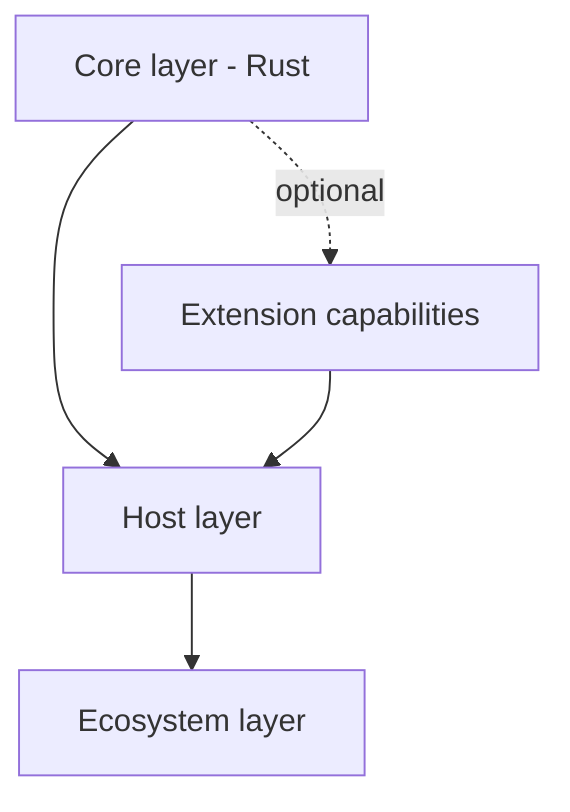

# ModuKit

> **ModuKit Runtime** — a modular plugin framework and polyglot extension toolkit.  
> Rust core · C ABI · in-process & multi-process plugins · service registry · script hosts · optional UI composition / zero-copy SHM / remote WebRTC

ModuKit is a **modular plugin host framework** for large-scale projects — large HMI, smart cockpit, multi-process UI hosts, remote streaming composition.

- **Core**: plugin lifecycle management (in-process and multi-process), service registry, polyglot bindings, script extension.
- **Optional extensions**: multi-process UI composition, zero-copy shared-memory transport, multi-machine remote WebRTC streaming.

It does not try to be a single "do-it-all engine". A layered architecture decouples the core plugin framework from the optional UI/streaming extensions: embed it as a lightweight plugin system, or build a complete distributed HMI host.

Full rationale, architecture, risks and references: **[whitepaper](docs/whitepaper.md)** (v1.0).

## Key capabilities

| Capability | Notes |
|---|---|
| Plugin lifecycle | install / start / stop / update / uninstall; unified model for in-process (`cdylib` + C ABI) and multi-process plugins (supervisor-managed, crash isolation, auto-restart) |
| Service registry | type-safe service discovery and dependency injection |
| IPC abstraction | one interface over local sockets, shared memory, remote transport |
| Capability discovery | platform differences (SHM, windowing, input injection, GPU sharing) declared and checked explicitly |
| Polyglot bindings | C/C++/Rust native · Python (PyO3) · C# (csbindgen) · JS/Node (napi-rs), all generated from the C ABI |
| Script & sandbox | Lua (mlua) · embedded JS (QuickJS/Boa) · WASM sandbox (wasmtime) for untrusted plugins |
| UI composition | main HMI as compositor; child processes submit frames via Wayland/X11 or SHM (I420), input events routed back |
| Remote streaming | WebRTC (webrtc-rs / getstream-rtc); receiver decodes to I420 and hands frames to the host over SHM |

## Architecture layers



- **Core**: plugin lifecycle, service registry, IPC abstraction, config & capability discovery
- **Host**: stable C ABI, binding generation, script engine hosts, transport abstraction
- **Ecosystem**: native / managed / sandboxed / script plugins
- **Extensions**: multi-process UI compositor, zero-copy SHM transport, remote WebRTC streaming

## Crate map (planned)

```toml
modukit-core          # core: plugin lifecycle, service registry, IPC abstraction
modukit-runtime       # runtime host (optional)
modukit-compositor    # multi-process UI compositor (extension)
modukit-transport     # transport abstraction: local SHM / remote WebRTC (extension)

modukit-c             # C ABI export
modukit-py            # Python bindings
modukit-cs            # C# bindings
modukit-js            # JS/Node bindings
modukit-wasm          # WASM host & sandbox
modukit-script-lua    # Lua extension host
modukit-script-js     # QuickJS/Boa extension host

modukit-platform-linux / win / macos
modukit-cli           # command-line tooling
```

## Roadmap

Five stages per the whitepaper implementation path:

- [ ] **Stage 1** — in-process plugin kernel: OSGi-style lifecycle & service registry
- [ ] **Stage 2** — multi-process plugins & zero-copy IPC: iceoryx2/Zenoh, I420 SHM transport
- [ ] **Stage 3** — multi-process UI composition: main-HMI compositor, Wayland/X11
- [ ] **Stage 4** — multi-machine remote WebRTC: encode, stream, route input back
- [ ] **Stage 5** — polyglot & script ecosystem: C ABI export, generated bindings, Lua/QuickJS/WASM hosts

## Platform support

| Platform | Local IPC | UI composition | Input injection | Notes |
|---|---|---|---|---|
| **Linux** | iceoryx2 / memfd | Wayland / X11 | uinput / XTest | primary validation platform (Ubuntu 20.04 first) |
| **Windows** | iceoryx2 / shared memory | Win32 (`SetParent`) | SendInput | needs PAL adaptation |
| **macOS** | iceoryx2 / shm_open | Cocoa (restricted) | CGEventPost | cross-process UI tightly limited; prefer pixel-stream |

## Development status

Design-baseline stage: whitepaper v1.0 defined, no implementation code yet. Crate naming and layout authority: `docs/whitepaper.md` §2 and §4.

First-time machine setup for dev toolchains (user-level, via mise; idempotent): `./bootstrap.sh` (Linux/macOS) or `bootstrap.bat` (Windows native). Pins live in `mise.toml`.

## Project language policy

All project artifacts (code, comments, docs, memory files) are written in English; AI-session chat follows the user's language. See `.agents/memorys/conventions.md` C1.

## License

TBD.
