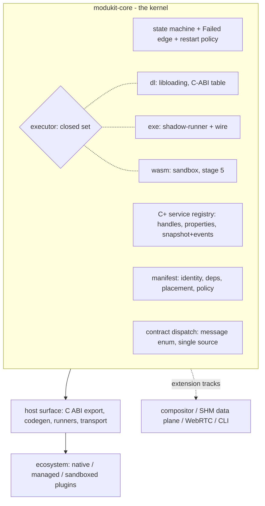

# ModuKit Architecture

**Status**: adjudicated engineering baseline (2026-10-10). Where this document differs from the
[whitepaper](whitepaper.md) v1.0 vision text, the delta table in §9 is authoritative and the
whitepaper remains canon for naming (§2.3) and principles (§3) not amended here.
**Provenance**: architecture questions were adjudicated one-by-one with the maintainer
(placement hybrid, availability grade in-vehicle-B, service model C+, solo+AI thin Stage-1
cut), recorded as D2-D5 in `.agents/memorys/decisions.md`.
**Deep dives**: numbered documents in [modules/](modules/00-overview.md).

---

## 1. Overview

ModuKit is a modular plugin host framework: in-process and multi-process plugin lifecycle,
type-safe service registry, one C ABI as the sole cross-language exit, and optionally a
multi-process UI composition / zero-copy / WebRTC extension stack (whitepaper §1).

The beachhead that shapes the first years is a family of projects starting with
an in-vehicle / large-screen HMI (Linux-primary, desktop-style form factor; UI modules,
business logic and device access all intended to be plugins), later tool-class products and a
cross-platform foundation. Nothing exists to migrate; the framework starts greenfield.
Year-1 plugin authors are trusted internal C++/Rust; polyglot and third-party plugins come
later — the ABI and the placement model are designed now, the per-language runners and
sandboxing are implemented later.

## 2. Design principles

Inherited (whitepaper §3, unchanged): narrow core · C ABI as the single cross-language exit ·
capability declarations beat assumptions · extensions opt-in · unified in-process /
multi-process model.

Added by adjudication (2026-10-10):

1. **Placement is a deployment property.** The executor set is closed {dl, exe, wasm}; the
   plugin ships one artifact; switching placement must not require code changes (D2).
2. **Language is an orthogonal axis.** JS/TS/Lua/Python are runners + generated SDKs, never
   new core mechanisms (D2).
3. **Switchability is a tested property, not a documented wish.** A plugin may claim
   dl/exe-switch only after the contract suite passes under both placements (D2).
4. **The abstraction never lies about asymmetries.** Crash blast radius and IPC cost differ
   by placement and must remain visible in the API surface (D2).
5. **Structure is one-shot, vocabulary is incremental.** The service object model is frozen
   for future OSGi-grade additions (handles, properties, events, ranking, acquire/release
   shapes); the dynamic vocabulary (LDAP/tracker/factory) ships only when a placement-verified
   need exists (D4).

## 3. Layered architecture



The whitepaper's four-layer view stands; what changed is that placement (executor) is now a
first-class kernel concept rather than a host-layer detail, and script/`*-bindings` crates are
reinterpreted as the language axis (§4).

## 4. The two axes

| Axis | Cardinality | Defined by | Year-1 members |
|---|---|---|---|
| Placement (executor) | closed set | the kernel | `dl`; `exe` interface only |
| Language (runner) | open set | the contract + codegen | Rust; C/C++ via C ABI |

Exe placement uses a **shadow runner**: the host spawns a generic
`modukit-run <plugin.so> --fd=N` child that `dlopen`s the *same artifact* and serves the wire
transport on the inherited fd. Precondition list, switch rules (`dl -> exe` free;
`exe -> dl` vetoed by trust tier) and the permanent asymmetries:
[modules/01-plugin-placement-model.md](modules/01-plugin-placement-model.md).

Industry anchors (repo profiles): dora operator/node same-contract
(`docs/reference/dora.md:48-52`), ipc-channel inprocess+cross-process backends
(`docs/reference/ipc-channel.md:14,96`), CLAP handshake (`clap-plugin-abi.md:26-37`);
VST3 Gateway and ROS2 components are industry knowledge, not repo-verified.

## 5. Contract and service model (summary)

Service interfaces are defined once and generate the C-ABI table (dl) and the serde wire
(exe). Dispatch is a message enum × transport; local transport may skip serialization but not
the message shape. Six invariants (handles not instances; monotonic registration ids;
case-insensitive properties; reserved ranking; snapshot+delta events; acquire/release call
shape) make later OSGi-grade vocabulary purely additive. Dependency declarations live in the
manifest with per-dependency consumer policy `wait | failfast | fallback`; LDAP, trackers,
factories and per-bundle leases are explicitly not implemented in year 1.

Boundary calls are synchronous or job-tokened with event completion (D6) — no
language-level async crosses the ABI. Deep dive:
[modules/02-service-model.md](modules/02-service-model.md),
[modules/04-contract-and-codegen.md](modules/04-contract-and-codegen.md). (D4/D6) Topics are the
second object kind of the same handle table (D10, modules/06); byte movement is vendor-swappable
only behind a narrow transport seam (D11, modules/07). The ledger is authored directly:
hand-written `.proto` is the single contract source; Rust skeletons, the C ABI and `fdset`
are its generated faces (D13).

## 6. Lifecycle and availability (summary)

Six-state OSGi-style machine plus a `Failed` edge; supervised restart with manifest-declared
policy `{none | on-failure, max_retries, backoff, cooldown}` — belonging to process placement;
under `dl` a C-UB crash is host-corrupting and the state machine says so. Boot is tiered and
parallel (`start_level` + dependency-respecting ordering). High-rate hardware data planes
(e.g. CAN-style streams) never traverse the plugin service bus: ModuKit owns orchestration,
not microseconds. Availability grade: in-vehicle engineering tier — no hard real-time
promises, no functional-safety certification surface; watchdog/ASIL integration is a system-
layer neighbor, not a kernel feature. Deep dive:
[modules/03-lifecycle-state-machine.md](modules/03-lifecycle-state-machine.md). (D3)

## 7. Trust tiers -> placement mapping

Replaces the whitepaper §6.4 prose (delta §9):

| Tier | Who | Placements | Enforcement |
|---|---|---|---|
| Trusted native | internal Rust/C++ | `dl` default, `exe` on deploy choice | full API |
| Semi-trusted script | internal Lua/JS runners | `exe`-hosted runner; `dl` only under review | restricted API surface |
| Untrusted third-party | vendors, marketplace | `exe` minimum, `wasm` default | sandbox, resource caps, switchability preconditions enforced by the host, not advised |

Host policy may force a *more* isolated placement, never a less isolated one.

## 8. Workspace and crate plan

Unchanged namespace authority (whitepaper §2.3); reinterpretations per §4:
`modukit-script-*` and `modukit-py/-cs/-js` are runner/SDK packages, `modukit-c` remains the
C ABI export, `modukit-wasm` is the third executor.

Stage-1 deliverable shape:

```text
Cargo.toml                 # workspace, resolver 3, edition 2024
crates/modukit-core/       # state / manifest / registry / contract / executor{dl,...} / errors
crates/example-plugin/     # cdylib fixture, ABI v1
crates/bad-plugin/         # negative fixture, ABI mismatch
```

Kernel-v0 (2026-10-10 experiment, parked by maintainer decision) validated the six-state
machine, Any-typed registry, libloading path and the dlopen integration-test harness
(cdylib artifacts must be built explicitly in-test). Three surgery points on resumption:
executor-trait seam, `Failed` edge, message-shaped service API. The parked backup is outside
the repo and transient (session memory records its path); do not treat its existence as a
repo fact.

## 9. Delta table vs whitepaper v1.0

| Whitepaper claim | Adjudicated state |
|---|---|
| §4.4/§6.2 "main HMI acts as compositor; child processes submit I420 frames" (a commitment) | demoted to extension/research track; sequencing per §12 |
| §6.1 "Crash isolation: a child-process crash does not affect the host" | kept, but scoped to process placement; `dl` documents no such guarantee (D2/D3) |
| §6.4 trust-tier prose | replaced by the placement-mapping table §7 |
| §4.1 "type-safe service discovery and dependency injection" | operationalized as C+: static binding + dynamic events + six invariants (D4) |
| §5 rows `modukit-script-lua` / `modukit-script-js` / bindings | language-axis runner packages, not core mechanisms (D2) |
| §8 stage ordering | deltas in §12 |
| principle "unified in-process / multi-process model" (§3.5) | implemented as the two-axis model (§4) |

## 10. Stage-1 scope (builder mode: solo + AI, demo-driven)

**In (built and tested)**: state machine incl. `Failed` + policy types; manifest v0
(fields settled, format TOML per D7); C+ registry (handles/properties/ids/events/snapshot,
acquire/release shapes); contract codegen v0 (Rust trait -> dispatch, local transport,
shapes locked;
`.proto` source + protoc plugin emitting Rust skeleton/C ABI/fdset, golden-file + regen-diff gates per D12/D13); `DlopenExecutor`; example/bad plugin fixtures; dlopen integration tests;
the contract suite structured for later dual-placement runs; the minimal in-process topic bus
with `latest-value` QoS (D10); the transport seam trait plus its local socketpair/memfd and
dummy test-double backends (D11); the descriptor access protocol and two-stage
retrieval API shape (D14, 07 §3-4); the introspect trio + `ModuleLoaded` event + the three
acceptance tests (D17, modules/10 — read-only services, zero UI); the live edge ledger + `Snapshot.edges()` (D18, ~100 lines); the logger service with `LogEvent` in the shared ring (D19, modules/10 §5); the unified clock service with timers-as-jobs (D20, modules/03 §6); gate counters on the same doorways (D21, modules/10 §6.1); template standing of the example/bad fixtures (D23); the `test-support` testhost face (D24, modules/10 §3.1).

**Out (interface only or absent)**: ProcessExecutor implementation, shadow-runner binary,
LDAP/tracker/factory/leases, all language bindings, compositor, SHM data plane, external
C-ABI export freeze, watchdog/safety surface, OTA/bundle distribution, CLI; cross-process bus wiring and any vendor pool/carrier linkage
(bridge plugins per D11 arrive when a real foreign graph does); recorder/replay implementation
(design recorded in modules/09, D16 — Stage-2 tooling).

**Accepted risk (declined by choice)**: no external-consumer validation round before the
contract freezes — C+ invariants stay unverified until the first non-kernel plugin touches
them. Re-review trigger recorded in D5.

## 11. Decisions

| ID | Subject | One-line |
|---|---|---|
| D1 | license | MIT OR Apache-2.0 dual (2026-10-09) |
| D2 | placement model | unified plugin, closed executor set, shadow-runner, tested switchability |
| D3 | availability | in-vehicle B tier: start levels, consumer policies, backoff restart; no hard RT |
| D4 | service model | C+: static binding + dynamic events, six B-compatible invariants, vocabulary reserved |
| D5 | Stage-1 cut | solo+AI thin edge; three v0 surgery points; long out-of-scope list |
| D6 | async model | synchronous boundary + job tokens + event completion; await is runner-side sugar; actor messaging as exe transport mechanics only |
| D7 | manifest residence | three tiers (deploy TOML / self-report descriptor / stage-5 binary verification) + mandatory cross-check with liar fixture |
| D8 | update semantics | stop-based (dl: activate-on-host-restart; exe: swap in restart cycle); `parallel_ok` declared escape hatch, routing ships Stage-2 |
| D9 | service identity | canonical reverse-DNS strings in properties; typed consts; bundle-scoped manifest aliases as sugar only |
| D10 | topic bus | four-kind object table (service/job/topic/descriptor); latest-value default QoS, three commandments; recorder/debugger as plain subscribers |
| D11 | transport architecture | kernel owns semantics; vendors swap behind a ~10-method seam; per-plane simultaneous slots; foreign middleware via bridge plugins, never a core swap |
| D12 | contract registry | hand-written-numbered `.proto` family + `fdset` ledger (regen-diff gate, three registry rules); envelope/cargo two lanes (Arrow sidecar framing) — authoring door revised by D13 |
| D13 | contract door | `.proto` authored directly = single source; protoc plugin emits Rust skeleton/C ABI/fdset (no exporter); kernel-internal types never enter the ledger; gRPC still out (substrate ≠ authoring) |
| D14 | descriptor access | self-sufficient tokens (slot/epoch/layout); attach-once pool transfer via UDS; borrows + EPOCH_EXPIRED liveness; two-stage retrieval (cheap meta, lazy data); carrier = deployment property, never type property |
| D15 | cargo oneof | two mutually-exclusive arms (local ticket / off-host tail, tag 1000); bridge exchanges ticket->tail; three-sheet definition law (type/ticket/deployment); pixels never enter .proto |
| D16 | recording & replay | recorder = ordinary export-gated subscriber (deep probe rejected); three-part self-describing header; gap stats as honest absence; replay = virtual publisher (content deterministic, timing not); mcap-first with own-format fallback |
| D17 | observability & debugging | introspect trio (ledger/snapshot/eventstream, trust-filtered) + ModuleLoaded event; churn/replay/ledger equality acceptance tests; DAP = off-the-shelf adapters for native, runner hook for scripts (Stage 5); Foxglove compat as D16 acceptance; zero bespoke UI/protocol in kernel |
| D18 | edge ledger & analysis | live (caller,service,method) counts at the stub doorway + declared ledger => graph/callers/impact/orphans/diff as pure walks; undeclared use = warn by default, reject is a policy knob |
| D19 | logger | kernel logger service acquired like any service; LogEvent joins the shared monotonic ring (identity/level/kv/seq) so sinks are subscribers, replay narrates, OTLP is a future sink — kernel never depends on OTel |
| D20 | clock & timers | one time source (`now` + timer-as-job) across real/sim/step domains; kernel timers ride it; replay turns the dial; hot paths use message `capture_ts`; interception and test-mock alternatives rejected |
| D21 | gate counters | edge latencies + topic rates/high-water as atomic adds at already-adjudicated doorways; read via Snapshot + CountersTick ring events; quantiles and OTel pushed downstream (P2 subscribers) |
| D22 | resource books | exe-only accounting (supervisor sampling + wait4; Snapshot fields; ResourceTick on the ring); dl entries say n/a honestly; quotas (cgroup/rlimit) deferred to first-untrusted-vendor trigger |
| D23 | scaffolding | example/bad fixtures hold template standing (changes = compatibility-weighted doc acts); `modukit new` = Stage-2 CLI subcommand, ledger-driven, dialect-free; B-before-C order rule |
| D24 | testhost | public `test-support` face: in-process host + dummy transport + step clock + fold-checker + fixture feed; three-piece surface discipline; true-process e2e stays with the Stage-2 suite |

Full records: `.agents/memorys/decisions.md`.
Queued for later adjudication (not silently dropped): JS dual-product-face (host-loads-JS vs
kernel-embedded-in-JS-app), capability-vocabulary design pass,
header-first vs metadata-first ABI (`docs/reference/00-overview.md` §4 queue), C-ABI export
freeze timing, `fallback` cached-value semantics, external-consumer validation round.

## 12. Roadmap (amended §8)

1. **Stage 1** — in-process kernel per §10 (unchanged in spirit; C+ semantics from day 1).
2. **Stage 2** — process placement: supervisor, shadow-runner, wire transport; executor
   interface itself ships in Stage 1. Zero-copy plane follows the open decision sheet
   (`docs/reference/00-overview.md` §2 — iceoryx2 local + Zenoh carrier; the *form* is adjudicated
per D11, only backend/vendor selection remains open).
3. **Stage 3** — multi-process UI composition: extension/research track (demoted; revisit with
   the beachhead's real UI demands).
4. **Stage 4** — remote WebRTC: unchanged; engine-tiering canon question still queued.
5. **Stage 5** — polyglot ecosystem on the language axis; the JS dual-face product decision
   is scheduled here.

## 13. Module documentation index

| Doc | Subject |
|---|---|
| [modules/00-overview.md](modules/00-overview.md) | index and reading order |
| [modules/01-plugin-placement-model.md](modules/01-plugin-placement-model.md) | executors, shadow-runner, switchability |
| [modules/02-service-model.md](modules/02-service-model.md) | C+ registry semantics and invariants |
| [modules/03-lifecycle-state-machine.md](modules/03-lifecycle-state-machine.md) | states, Failed edge, boot orchestration |
| [modules/04-contract-and-codegen.md](modules/04-contract-and-codegen.md) | single source, two transports, handshake |
| [modules/05-manifest-and-deployment.md](modules/05-manifest-and-deployment.md) | manifest fields, deploy-time placement rules |
| [modules/06-topics-and-bus.md](modules/06-topics-and-bus.md) | topics, QoS, the object table |
| [modules/07-transport-architecture.md](modules/07-transport-architecture.md) | transport seam, slots, bridges |
| [modules/08-end-to-end-walkthrough.md](modules/08-end-to-end-walkthrough.md) | end-to-end worked example: one video frame across all layers |
| [modules/09-recording-and-replay.md](modules/09-recording-and-replay.md) | recording, replay, container policy |
| [modules/10-observability-and-debugging.md](modules/10-observability-and-debugging.md) | introspect trio, logger, edge ledger + analysis, debug lanes, tool constitution |

## 14. Appendix: reference projects

Twenty profiles in `docs/reference/` (index: `00-overview.md`). The ones load-bearing for
this document: CppMicroServices (state machine + service semantics mirror; also the cautionary
"no remote story" — `cppmicroservices.md:80`), dora (same-contract two placements),
ipc-channel (one API, inprocess+cross-process backends, weight accounting), CLAP (handshake
shape), rutis (dlopen pitfalls + declared non-goals), zellij (contained-crash presentation),
CTK (15-year edge-case ledger). Whitepaper citation audit:
`whitepaper-cited-unvendored.md`.
