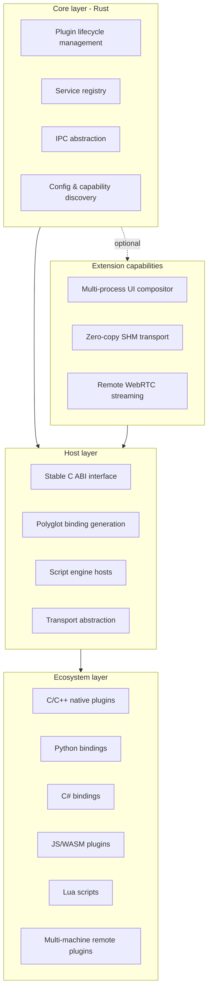

# ModuKit Whitepaper

**Version**: 1.0  
**Positioning**: modular plugin framework & polyglot extension toolkit  
**Core language**: Rust  
**Target scenarios**: large-scale HMI, smart cockpit, multi-process UI hosts, remote streaming composition

---

## 1. Overview

ModuKit is a **modular plugin host framework** for large-scale projects. Its core capabilities are in-process and multi-process plugin lifecycle management, service registry, polyglot bindings, and script extension. On top of that, ModuKit can optionally support **multi-process UI composition**, **zero-copy shared-memory transport**, and **multi-machine remote WebRTC streaming**.

The project does not try to be a single "do-it-all engine". Through a layered architecture it decouples the **core plugin framework** from the **optional UI/streaming extensions**, so developers can either embed ModuKit as a lightweight plugin system or build a complete distributed HMI host.

---

## 2. Naming & Branding

### 2.1 Primary name: ModuKit

- **Composition**: Module + Kit
- **Meaning**: a modular kit — precisely covering the core identity of "pluggable framework + polyglot SDK".
- **Naming style**: continues the "name-by-technical-essence" logic of `CppMicroServices` and `CTK`, but more concise.
- **Extended positioning**: multi-process UI composition, remote streaming, and runtime hosting are carried by sub-packages and the tagline as extension capabilities; they do not pollute the primary name.

### 2.2 Full project name and description

> **ModuKit Runtime** — a modular plugin framework and polyglot extension toolkit.  
> Core: plugin lifecycle, service registry, polyglot bindings, script hosts. Extensions: multi-process UI composition, zero-copy shared memory, and remote WebRTC streaming.

### 2.3 Namespace plan

```toml
modukit-core          # core: plugin lifecycle, service registry, IPC abstraction
modukit-runtime       # runtime host (optional)
modukit-compositor    # multi-process UI compositor (extension)
modukit-transport     # transport abstraction: local SHM / remote WebRTC (extension)

modukit-c             # C ABI export
modukit-py            # Python bindings
modukit-cs            # C# bindings
modukit-js            # JS/Node bindings
modukit-wasm          # WASM host & sandbox
modukit-script-lua    # Lua extension host
modukit-script-js     # QuickJS/Boa extension host

modukit-platform-linux / win / macos
modukit-cli           # command-line tooling
```

### 2.4 Availability check summary

- **crates.io / npm**: `modukit` is unclaimed.
- **PyPI**: a `modukit-dj` package uses the "ModuKit" spelling, but it is a Django module-management tool in an unrelated domain.
- **Domain**: `modukit.com` is long-taken; use `modukit.dev` or `modukit.rs`.
- **Trademark**: same-name brands exist in furniture/art domains; no direct conflict with software/HMI.

---

## 3. Design Principles

1. **Core is narrow and deep**: the Rust core handles only plugin lifecycle, service registry, IPC abstraction and the basic runtime; it embeds no script engine and no UI compositor.
2. **C ABI is the single cross-language exit**: every external export goes through a C ABI; polyglot bindings are generated, never hand-written per language.
3. **Capability declarations beat assumptions**: platform differences are managed explicitly through capability discovery; plugins declare the capabilities they need in their manifest.
4. **Extensions are opt-in**: multi-process UI, SHM and WebRTC are optional extension packages; no user is forced to load everything.
5. **Unified in-process / multi-process model**: the plugin model supports both in-thread plugins and standalone-process plugins with identical lifecycle semantics.

---

## 4. Architecture



### 4.1 Core layer

- Plugin lifecycle: install, start, stop, update, uninstall.
- Service registry: type-safe service discovery and dependency injection.
- IPC abstraction: one interface over local sockets, shared memory, and remote transport.
- Capability discovery: declare and check platform capabilities (SHM, windowing systems, input injection, GPU sharing).

### 4.2 Host layer

- Exports a stable C ABI.
- Maintains polyglot bindings through code generation.
- Integrates script engine hosts (Lua, QuickJS/Boa, WASM).
- Provides the transport abstraction that extension packages implement.

### 4.3 Ecosystem layer

- Native plugins: Rust, C/C++.
- Managed plugins: Python, C#, JS/Node.
- Sandboxed plugins: WASM.
- Script extensions: Lua, embedded JS.

### 4.4 Extension capabilities

- **Multi-process UI composition**: the main HMI acts as compositor; child processes act as UI clients, submitting frames via Wayland/X11 or shared memory.
- **Zero-copy SHM**: raw I420 frames transferred directly between local processes, no encode/decode.
- **Remote WebRTC streaming**: in multi-machine setups frames are encoded and streamed, with input events routed back.

---

## 5. Technology Choices

| Layer | Technology | Notes |
| :--- | :--- | :--- |
| **Core language** | Rust | memory safety, high performance, no GC |
| **Cross-language ABI** | C ABI | stable exit, with `cbindgen`, `uniffi`, `csbindgen` |
| **Python bindings** | PyO3 | mature; mind the GIL and async interaction |
| **C# bindings** | csbindgen / P/Invoke | string encoding and GC interop |
| **JS/Node bindings** | napi-rs | good developer experience, mature |
| **WASM host** | wasmtime / wasmer | sandboxed execution of untrusted plugins |
| **Lua host** | mlua | Lua 5.1-5.4 and Luau |
| **Embedded JS** | QuickJS / Boa | small footprint, fits extension logic |
| **Local IPC** | iceoryx2 / Zenoh | zero-copy SHM, sub-microsecond latency |
| **Remote transport** | webrtc-rs / getstream-rtc | WebRTC codec and transport |
| **UI composition** | Wayland / X11 / Qt | platform adaptation; optional X11 window reparenting |
| **Input injection** | enigo / uinput / SendInput / CGEventPost | cross-platform input simulation |
| **Video frame format** | I420 | local zero-copy transport, WebRTC bridge |

---

## 6. Key Capabilities

### 6.1 Multi-process plugin management

- In-process plugins: dynamically loaded `cdylib`, called through the C ABI.
- Multi-process plugins: a supervisor process starts, monitors and restarts child-process plugins.
- Lifecycle synchronization: state machines managed uniformly over IPC.
- Crash isolation: a child-process crash does not affect the host; automatic restart is supported.

### 6.2 Multi-process UI composition

- The main HMI process acts as compositor/container.
- After rendering, child-process UI submits I420 frames via shared memory, or windows via Wayland/X11.
- Input events are captured by the main process and routed to the active child.
- Single-machine multi-process and multi-machine remote UI integrate through one path.

### 6.3 Zero-copy and remote transport

- **Local**: iceoryx2/Zenoh SHM carries raw I420 frames, no codec.
- **Multi-machine**: WebRTC carries encoded video; the receiver decodes to I420 and hands it to the main HMI over SHM.
- **Bridge**: `getstream/rtc` provides `write_i420()` and `next_video_frame()` for a seamless connection.

### 6.4 Polyglot and script extension

- **Trusted plugins**: C/C++/Rust native plugins, full API.
- **Semi-trusted plugins**: Lua, embedded JS — restricted API.
- **Untrusted plugins**: WASM sandbox behind WASI interfaces.
- All language bindings are generated from the same C ABI.

---

## 7. Platform Strategy

| Platform | Local IPC | UI composition | Input injection | Notes |
| :--- | :--- | :--- | :--- | :--- |
| **Linux** | iceoryx2 / memfd | Wayland / X11 | uinput / XTest | primary validation platform |
| **Windows** | iceoryx2 / shared memory | Win32 | SendInput | needs a PAL adaptation |
| **macOS** | iceoryx2 / shm_open | Cocoa (restricted) | CGEventPost | cross-process UI tightly limited |

- **Linux**: support Ubuntu 20.04 first; Wayland uses a compositor, X11 uses window reparenting or a dedicated WM.
- **Windows**: embed external windows via `SetParent`.
- **macOS**: cross-process window embedding is restricted; keep functional modules in the main process, or use a pixel-stream approach.

---

## 8. Implementation Path

1. **Stage 1: in-process plugin kernel**  
   OSGi-style lifecycle and service registry; reference `rutis`, `rustbridge`.

2. **Stage 2: multi-process plugins & zero-copy IPC**  
   Introduce iceoryx2/Zenoh, SHM transport of I420 frames; reference `event-engine`, `RS VST Host`.

3. **Stage 3: multi-process UI composition**  
   Main-HMI compositor, Wayland/X11; reference `Parallax`, `Scarlet`.

4. **Stage 4: multi-machine remote WebRTC**  
   Integrate webrtc-rs/getstream-rtc: encode, stream, route input back; reference `vnrit`.

5. **Stage 5: polyglot & script ecosystem**  
   Export the C ABI, generate Python/C#/JS/WASM bindings, integrate Lua/QuickJS/WASM hosts.

---

## 9. Risks & Mitigations

| Risk | Mitigation |
| :--- | :--- |
| Architectural complexity | strict layering, core/extensions decoupled, staged delivery |
| Rust ABI instability | cross-language only through C ABI, code-generated bindings |
| Large platform differences | capability discovery, platform adaptation layer, explicit support matrix |
| Performance vs isolation trade-off | in-process plugins for performance, out-of-process for isolation |
| Script engine security | WASM sandbox for untrusted plugins, resource limits and audit |
| Combinatorial explosion | publish an official support matrix; community maintains other combinations |

---

## 10. Summary

ModuKit is a large-project framework with Rust at its core, a modular plugin framework as its identity, and a polyglot extension toolkit as its delivery form. It connects the polyglot ecosystem through the C ABI, achieves local zero-copy through shared memory, achieves multi-machine reach through WebRTC, and supports complex HMI scenarios through an optional UI compositor and script hosts.

**ModuKit does not aim to be a single engine — it aims to be the host platform that connects and composes many technologies.**
